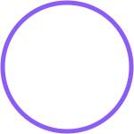

# 👋 Hi! I'm akirakawashi

  
    
  

  
  
  

## 🚀 About Me

  

Backend developer with experience in microservice architecture, machine learning, and system administration. I specialize in Python, Java, and SQL development. I love creating efficient solutions for complex tasks.

---

## 🛠️ Skills and Technologies

  <h3>Backend</h3>
  
  
  
  
  
  

  <h3>Frontend</h3>
  
  
  
  
  
  lf

  <h3>Databases</h3>
  
  
  
  
  

  <h3>Machine Learning & AI</h3>
  
  
  
  
  
  

  <h3>DevOps & Tools</h3>
  
  
  
  
  

## 📊 GitHub Statistics

  

### 💼 Professional Experience
- **Author of AiNoCraft project** (2026 - present)
  - Microservice architecture for game server
  - Full CI/CD pipeline, JWT authentication
  - Development of launcher on PyQt5 and mods on Java

- **SQL Developer / Support Specialist** (2024 - present)
  - Full database development cycle: PL/SQL packages, procedures, triggers
  - Creation of complex reports and user support

- **ML Engineer (Computer Vision)** (2025)
  - Video monitoring system with YOLOv8 for barrier automation
  - Real-time video processing with ROI detection

- **ML Engineer (Audio → JSON)** (2025)
  - Speech to structured JSON conversion
  - Pipeline: Whisper + LLM via Hugging Face

---

  
  
  
  

  
💬 <strong>Open to collaboration and new projects!</strong>

---